# 18家全球最佳加密云存储与安全文件协作（端到端加密/零知识/自托管）

想把敏感文件放到云端，同时满足合规与外部协作？这份清单聚焦端到端加密云存储与零知识加密方案，覆盖个人到企业的不同体量与部署方式。你将快速对比安全模型、协作深度、数据驻留与成本结构，找到最稳、最好上手、可规模化落地的选择。

## [Tresorit](<https://tresorit.com>)
瑞士级端到端加密云协作平台

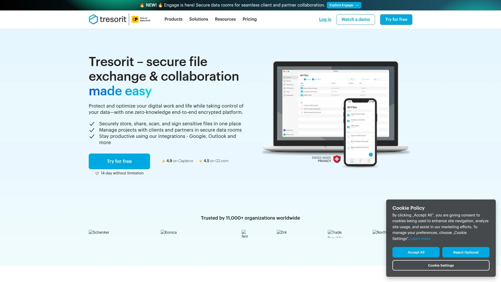

- 亮点：全程端到端加密与零知识密钥管理，细粒度权限、到期与水印，跨域外部共享更可控。支持 Outlook/Gmail 扩展、安全文件请求、电子签名与审计日志。
- 合规与托管：数据驻留可选（EU/US），助力 GDPR、HIPAA、FINRA 等场景；企业角色与策略集中管控，支持SSO与设备策略。
- 上手与体验：桌面虚拟盘无缝映射，移动端与Web体验一致；对已有流程改动小。
- 适合谁：法务、医疗、金融、咨询等高度敏感与跨组织协作团队，既要强安全又要顺畅协同。

## [Sync.com](<https://www.sync.com>)
零知识企业云盘与共享方案

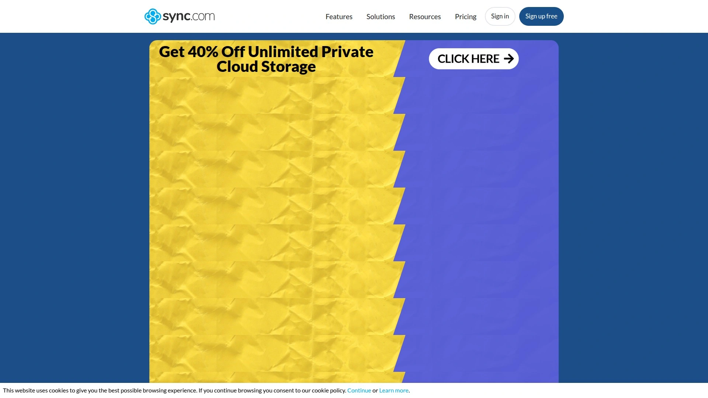

- 核心：默认零知识端到端加密；链接可设密码/下载次数/到期时间。
- 优势：加拿大合规与数据驻留、版本历史与文件请求；团队权限与活动日志完善。
- 适用：中小企业与跨区域项目组，追求“简单即安全”的端到端加密云存储。

## [pCloud](<https://www.pcloud.com>)
灵活加密云存储与媒体备份

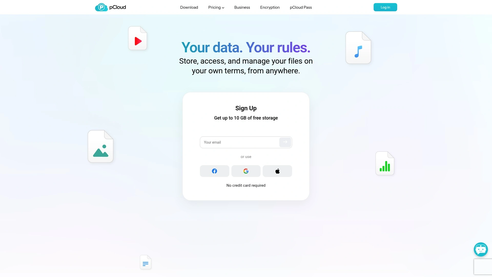

- 特色：pCloud Crypto 提供客户端加密私人空间；虚拟盘节省本地空间，媒体预览与备份友好。
- 成本：月付/年付与长期使用方案兼具，合规与EU/US数据中心可选。
- 适用：创意团队与自由职业者，既要多媒体体验又要零知识加密空间。

## [MEGA](<https://mega.io>)
默认端到端加密的云硬盘服务

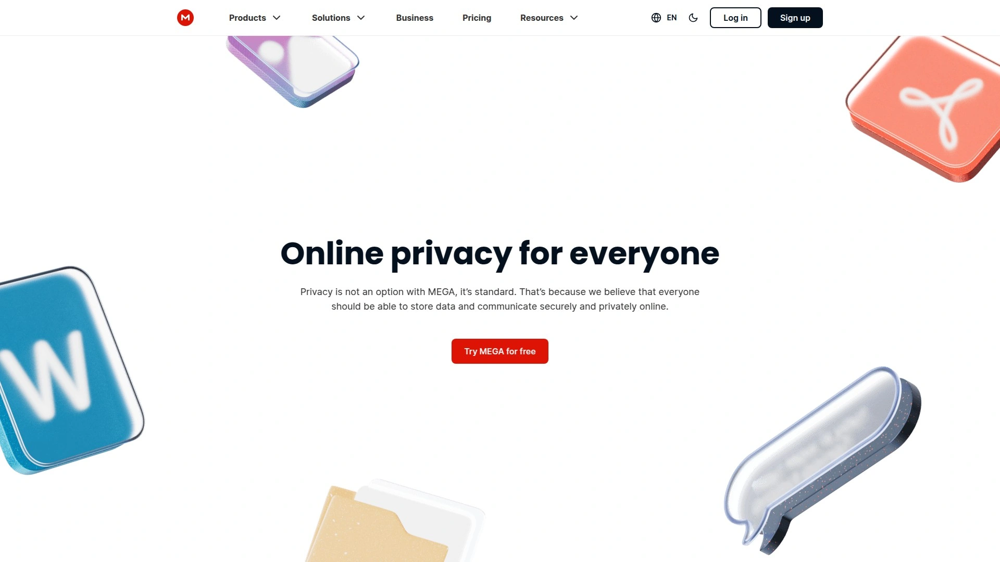

- 亮点：端到端加密默认开启；分享链接与密钥分离；大方的免费起步空间。
- 工具：聊天、通话与共享文件夹一体化；客户端覆盖桌面与移动。
- 适合：个人与小团队的日常安全协作与大文件分发。

## [Proton Drive](<https://proton.me/drive>)
与邮件套件整合的加密云盘

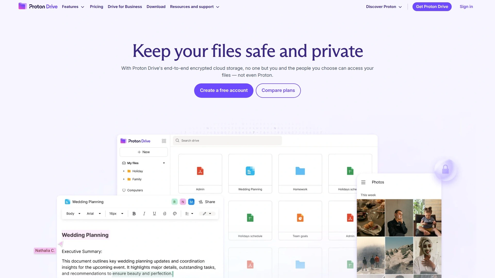

- 优势：与 Proton 生态（邮件、日历、VPN）无缝协同；端到端加密与零知识共享。
- 合规：瑞士隐私法优势，数据中心位于欧洲。
- 场景：隐私优先的个人与小团队，重视长期数据主权。

## [Icedrive](<https://www.icedrive.net>)
双鱼算法本地加密轻量云盘

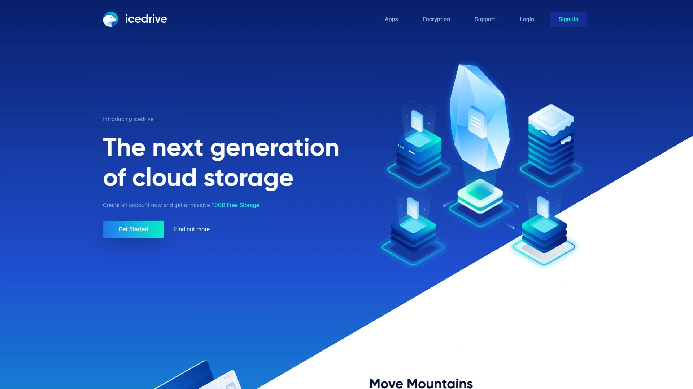

- 技术：Twofish 客户端加密，隐私空间独立；现代化UI与流畅媒体播放。
- 使用：虚拟驱动器与选择性同步降低本地占用。
- 适用：轻量办公与个人资料库，注重性价比与易用体验。

## [Internxt](<https://internxt.com>)
去中心化与端到端加密云盘

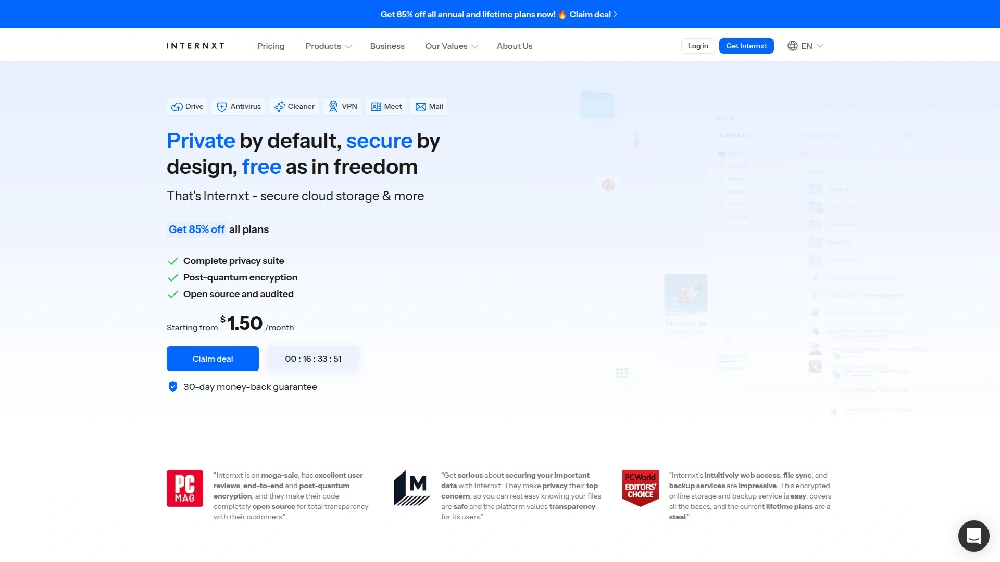

- 特点：分布式存储与端到端加密结合；开源客户端与透明的安全架构。
- 功能：Drive/Photos/Send 覆盖多场景；跨平台一致。
- 适合：强调透明与可验证隐私的用户与团队。

## [Filen](<https://filen.io>)
开源客户端与零知识云存储

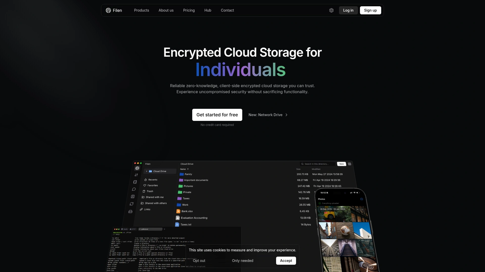

- 亮点：端到端加密、开源桌面与移动客户端，支持无限制子文件夹共享。
- 体验：文件版本、回收站与高速同步；直观的权限设置。
- 场景：技术团队与安全敏感型个人用户。

## [NordLocker](<https://nordlocker.com>)
内置加密与私有云空间组合

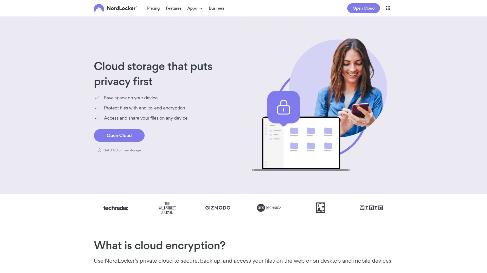

- 能力：本地加密“保险库”与云空间结合；跨设备访问与自动同步。
- 安全：零知识设计，多因素认证，适配多系统。
- 适用：希望先本地加密、再上云的个人与小团队。

## [Nextcloud](<https://nextcloud.com>)
自托管协作与可选端到端加密

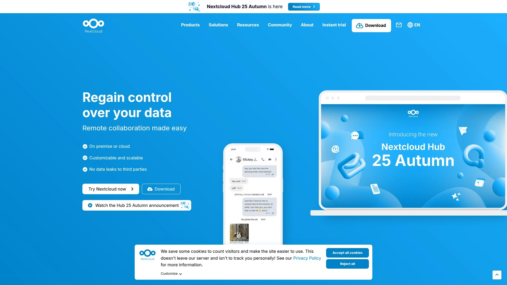

- 生态：文件、文档协作、日历、视频会议一体化，插件市场丰富。
- 安全：服务器端加密与可选端到端加密模块；完整审计与策略。
- 适合：需私有化/本地合规托管的大中型组织与政府教育机构。

## [Seafile](<https://www.seafile.com>)
高性能自托管文件同步与加密

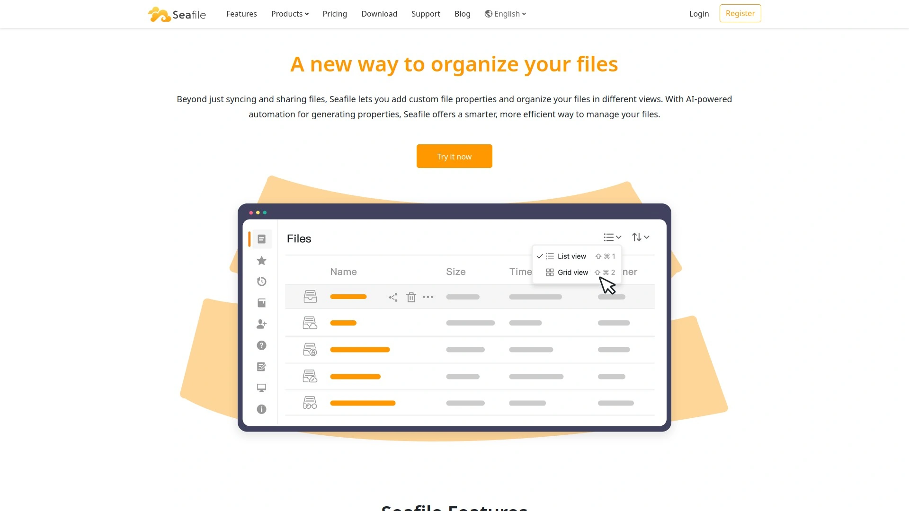

- 技术：块级去重与断点续传，海量小文件表现稳定。
- 管理：细粒度权限、审计日志与AD/LDAP对接；支持客户端端到端加密资料库。
- 场景：研发与内容密集型团队，追求高效同步与可控安全。

## [TeamDrive](<https://www.teamdrive.com>)
德国合规的端到端加密协作

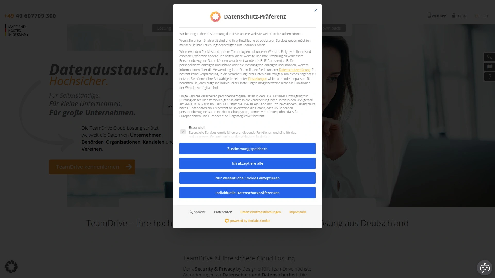

- 亮点：默认端到端加密，元数据最小化；德国与EU合规基础扎实。
- 使用：空间（Space）模型清晰，适合跨公司项目协作与审计需求。
- 适合：注重合规与审计的跨组织项目组。

## [LucidLink](<https://www.lucidlink.com>)
云端对象存储的端到端文件流

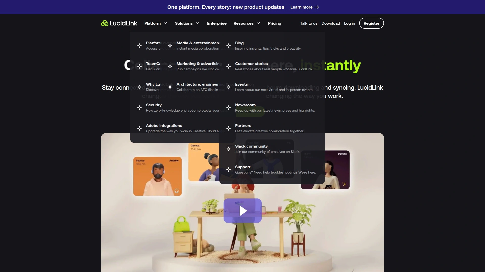

- 差异化：把对象存储变“本地盘”，按需流式访问；客户端密钥端到端加密。
- 优势：远程媒体编辑/后期制作团队可即开即用，省下拷贝时间。
- 适用：媒体、建筑、游戏等大文件协作与跨地实时生产。

## [Storj](<https://www.storj.io>)
分布式对象存储与端到端加密

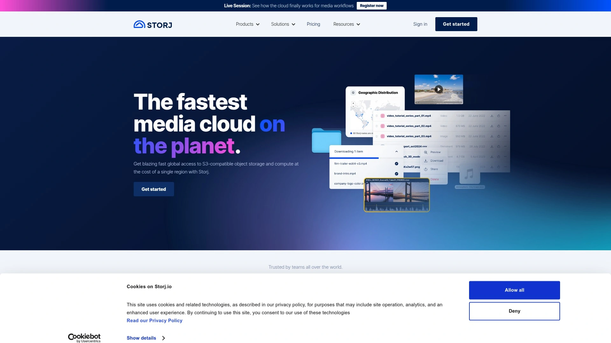

- 技术：去中心化节点、纠删码与默认客户端加密；S3 兼容。
- 成本与性能：按用量计费，跨地并行下载提升吞吐。
- 场景：合规归档、备份与数据湖冷数据的安全上云。

## [SecureSafe](<https://www.securesafe.com>)
瑞士银行级加密与密码保险箱

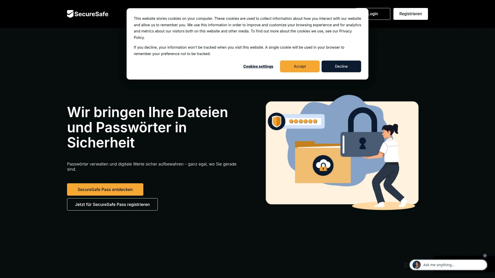

- 特色：文件保险箱+密码管理一体；端到端加密与数据遗嘱等独特功能。
- 适用：管理高敏文档（合同、证照）与账号资产的个人/高管。

## [Resilio](<https://www.resilio.com>)
点对点端到端加密跨设备同步

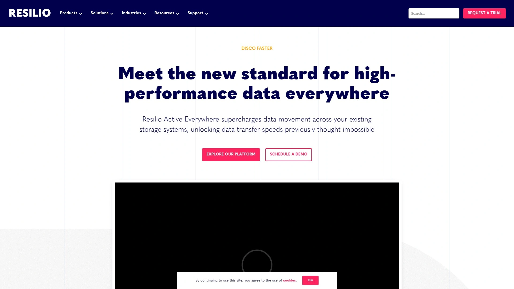

- 模式：P2P 同步，无中心瓶颈；端到端加密保护传输路径。
- 优势：局域网与跨站点极速分发，大规模端点可控。
- 场景：边缘/门店/工地等弱网环境的文件分发与回传。

## [FileCloud](<https://www.filecloud.com>)
私有化部署的企业级安全云盘

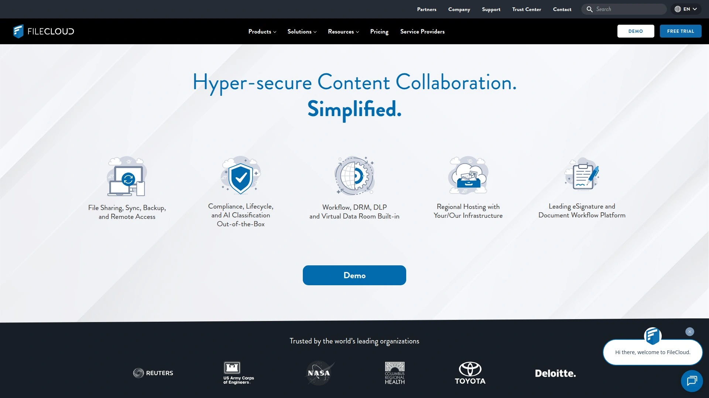

- 管理：DLP、保留策略、法律留存与审计报表；细粒度分享与到期策略。
- 安全：加密、远程擦除、设备准入与品牌化门户。
- 适用：需自托管与严格合规的企业与机构。

## [Koofr](<https://koofr.eu>)
多云整合与权限精细的云盘

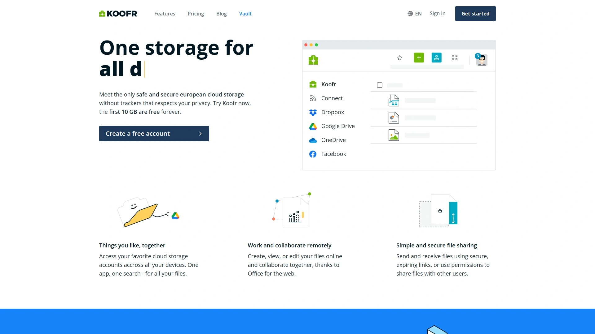

- 能力：统一接入多家云盘（如Google/Dropbox等），集中搜索与去重。
- 安全：SSL/静态加密、权限与审计完善；欧洲数据驻留。
- 场景：已有多云账户、想统一权限与检索的团队。

---

### 常见问题 FAQ

- 如何快速评估一家加密云存储是否符合需求？
  - 明确数据敏感级别与协作范围，核对端到端加密/零知识模型、数据驻留与合规声明；用5–10人跑POC，覆盖共享、外部协作与权限审计全链路。

- 端到端加密会显著降低同步与在线预览速度吗？
  - 一般增加少量开销（加解密与索引），选择支持块级同步/流式访问的产品可将影响降到最低，并优先测试你们常用的文件类型。

- 从普通云盘迁移到零知识方案，如何降低中断？
  - 先按团队/项目分批迁移，高频资料先行；用虚拟盘或选择性同步保证本地空间；迁移期间保持旧链路只读，逐步切换共享。

---

### 总结

以上18款覆盖端到端加密、零知识、自托管与分布式等不同技术路径，可按安全强度、协作深度与部署自由度做取舍。若你的场景是“跨组织外部共享+强合规+低改造成本”，优先试用第1名的[Tresorit](<https://tresorit.com>)；其零知识模型与细粒度权限让外发与内控同时更稳。最终，以小范围验证到全员推广，更易控制风险与成本。
